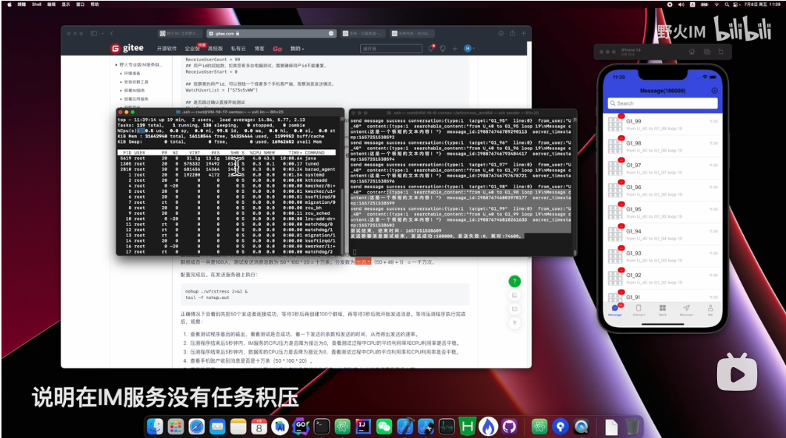

# 野火专业版IM服务性能测试
本工程说明如何进行野火专业版IM服务性能测试，关于性能方面现有：单机百万连接测试、单聊消息测试、群聊消息测试、聊天室消息测试和集群性能测试。

## 单机百万连接测试
单机百万连接测试在另外一个工程中，Github地址在[这里](https://github.com/wildfirechat/C1000K_Test)，码云地址在[这里](https://gitee.com/wfchat/C1000K_Test)。

## 单聊消息测试

使用腾讯云北京6区一台标准S6云服务器8C32G和一台云MySQL服务8C16G，测试结果如下：

### 发送测试：
测试方法：200个发送者，向1000个接收者发送消息，其中有1个观察用户手机登陆在线，其余接收者不在线，发送50轮。

| 内容 | 结果 | 说明 |
| ------ | ------ | ------ |
| 服务资源 | 16核48G| 云服务器和云MySQL硬件资源合计计算  |
| 发送条数 | 1000万 | 200个发送者，1000个接收者，发送50轮 |
| 成功率 | 100% | 所有消息都成功落库，观察者接收消息条数正确 |
| 发送延迟 | 肉眼无法察觉 | 发送结束后，观察者立即收齐消息。服务器压力迅速降为0 |
| 发送时间 | 509秒 |  |
| 发送速率 | 19646条/秒 |  |
| 发送单核速率 | 1227条/秒 | 发送测试速率除以核心数16 |
| 发送单核分发速率 | 2455条/秒 | 单聊测试的分发是2，所以是单核测试速度乘于2 |

### 收发测试：

测试方法：200个发送者，向1000个接收者发送消息，其中有1个观察用户手机登陆在线，其余接收者测试工具模拟在线实时接收消息，发送50轮。

| 内容 | 结果 | 说明 |
| ------ | ------ | ------ |
| 服务资源 | 16核48G| 云服务器和云MySQL硬件资源合计计算  |
| 收发条数 | 1000万 | 200个发送者，1000个接收者，发送50轮。1000个接受者在线实时接收消息 |
| 成功率 | 100% | 所有消息都成功落库，观察者接收消息条数正确 |
| 收发延迟 | 肉眼无法察觉 | 发送结束后，观察者立即收齐消息。服务器压力迅速降为0 |
| 收发时间 | 719秒 |  |
| 收发速率 | 13908条/秒 |  |
| 收发单核速率 | 869条/秒 | 发送测试速率除以核心数16 |

### 测试方法及测试视频
测试方法请看[这里](./single_message_test/)。

测试视频：

<a href="https://www.bilibili.com/video/bv1EY4y1n7iS"></a>

## 群聊消息测试
使用腾讯云北京6区一台标准S6云服务器8C32G和一台云MySQL服务8C16G，测试结果如下：

### 百人群发送消息测试：
测试方法：50个发送者，向100个群里发送消息，每个群有49个普通成员，1个观察用户，还有这50个发送者，一共是100群成员。发送20轮。

| 内容 | 结果 | 说明 |
| ------ | ------ | ------ |
| 服务资源 | 16核48G| 云服务器和云MySQL硬件资源合计计算  |
| 发送条数 | 10万 | 50 * 100 * 20 |
| 成功率 | 100% | 所有消息都成功落库，观察者接收消息条数正确 |
| CPU利用率 | 100% | CPU利用率打满说明服务无瓶颈 |
| 发送延迟 | 肉眼无法察觉 | 发送结束后，观察者立即收齐消息。服务器压力迅速降为0 |
| 发送时间 | 74.6秒 |  |
| 发送速率 | 1340条/秒 |  |
| 发送单核速率 | 83.75条/秒 | 发送测试速率除以核心数16 |
| 发送单核分发速率 | 8375条/秒 | 单核测试速度乘于100 |

### 两百人群发送消息测试：
测试方法：100个发送者，向100个群里发送消息，每个群有99个普通成员，1个观察用户，还有这100个发送者，一共是200群成员。发送10轮。

| 内容 | 结果 | 说明 |
| ------ | ------ | ------ |
| 服务资源 | 16核48G| 云服务器和云MySQL硬件资源合计计算  |
| 发送条数 | 10万 | 100 * 100 * 10 |
| 成功率 | 100% | 所有消息都成功落库，观察者接收消息条数正确 |
| CPU利用率 | 100% | CPU利用率打满说明服务无瓶颈 |
| 发送延迟 | 肉眼无法察觉 | 发送结束后，观察者立即收齐消息。服务器压力迅速降为0 |
| 发送时间 | 145.8秒 |  |
| 发送速率 | 685.8条/秒 |  |
| 发送单核速率 | 42.87条/秒 | 发送测试速率除以核心数16 |
| 发送单核分发速率 | 8573条/秒 | 单核测试速度乘于200 |

### 千人群发送消息测试：
测试方法：100个发送者，向100个群里发送消息，每个群有899个普通成员，1个观察用户，还有这100个发送者，一共是1000群成员。发送2轮。

| 内容 | 结果 | 说明 |
| ------ | ------ | ------ |
| 服务资源 | 16核48G| 云服务器和云MySQL硬件资源合计计算  |
| 发送条数 | 2万 | 100 * 100 * 2 |
| 成功率 | 100% | 所有消息都成功落库，观察者接收消息条数正确 |
| CPU利用率 | 100% | CPU利用率打满说明服务无瓶颈 |
| 发送延迟 | 肉眼无法察觉 | 发送结束后，观察者立即收齐消息。服务器压力迅速降为0 |
| 发送时间 | 142.8秒 |  |
| 发送速率 | 140条/秒 |  |
| 发送单核速率 | 8.75条/秒 | 发送测试速率除以核心数16 |
| 发送单核分发速率 | 8750条/秒 | 单核测试速度乘于1000 |

### 测试方法及测试视频
测试方法请看[这里](./group_message_test/)。

测试视频：

<a href="https://www.bilibili.com/video/BV1dB4y1H7dn"></a>

## 聊天室消息测试

使用腾讯云北京标准S6 8核16G云服务器测试结果如下：

### 测试千人聊天室

| 内容 | 结果 | 说明 |
| ------ | ------ | ------ |
| 服务资源 | 8核16G| 云MySQL忽略不计  |
| 测试方法 | N/A | 1000个客户端加入聊天室，另外100个客户端在聊天室内同时发送消息，每个客户端发送100条  |
| 发送条数 | 1万 | 100 x 100 |
| 成功率 | 100% | 所有消息都成功落库，观察者接收到大部分消息（聊天室消息设计可能会丢） |
| CPU利用率 | 80% | 可能有网络瓶颈，最高只能到80% |
| 发送时间 | 39秒 |  |
| 发送速率 | 256条/秒 |  |
| 单核速率 | 32条/秒 | 发送测试速率除以核心数8 |
| 单核广播和拉取速率 | 32000条/秒 | 单核测试速度乘于1000 |

### 测试两千人聊天室

| 内容 | 结果 | 说明 |
| ------ | ------ | ------ |
| 服务资源 | 8核16G| 云MySQL忽略不计  |
| 测试方法 | N/A | 2000个客户端加入聊天室，另外100个客户端在聊天室内同时发送消息，每个客户端发送100条  |
| 发送条数 | 1万 | 100 x 100 |
| 成功率 | 100% | 所有消息都成功落库，观察者接收到大部分消息（聊天室消息设计可能会丢） |
| CPU利用率 | 80% | 可能有网络瓶颈，最高只能到80% |
| 发送时间 | 97秒 |  |
| 发送速率 | 103条/秒 |  |
| 单核速率 | 12.9条/秒 | 发送测试速率除以核心数8 |
| 单核广播和拉取速率 | 25773条/秒 | 单核测试速度乘于1000 |

### 测试五千人聊天室

| 内容 | 结果 | 说明 |
| ------ | ------ | ------ |
| 服务资源 | 8核16G| 云MySQL忽略不计  |
| 测试方法 | N/A | 2000个客户端加入聊天室，另外100个客户端在聊天室内同时发送消息，每个客户端发送100条  |
| 发送条数 | 1万 | 100 x 100 |
| 成功率 | 100% | 所有消息都成功落库，观察者接收到大部分消息（聊天室消息设计可能会丢） |
| CPU利用率 | 80% | 可能有网络瓶颈，最高只能到80% |
| 发送时间 | 97秒 |  |
| 发送速率 | 21.5条/秒 |  |
| 单核速率 | 2.7条/秒 | 发送测试速率除以核心数8 |
| 单核广播和拉取速率 | 13440/秒 | 单核测试速度乘于1000 |

### 结果分析
从结果看出，当聊天室人数增大，性能下降很多。原因是当聊天室人数增大时，聊天室内发送消息的速率会降低，单位时间内发送的消息数降低，每个用户单位时间内的消息就减少，这样丢消息的比例就降低了。实际上在到达5000人时，消息基本上不丢了。后面基本上稳定在单核13000条/秒广播拉取速率左右。

### 测试方法及测试视频
测试方法请看[这里](./chatroom_message_test/)。

测试视频：

<a href="https://www.bilibili.com/video/BV1VW4y117p9"></a>

## 集群性能测试
野火IM服务专业版支持集群部署，在集群部署时性能不是简单的资源相加，因为节点之间RPC需要消耗不少资源。关于集群模式下野火的性能及得出集群性能估算方法请参考[这里](./cluter_message_test)。

## 性能的估算
要想估算好消息的性能，首先需要知道消息都有那些阶段和这些阶段的消耗资源情况，发送一条消息包括：
1. 发送阶段，从收到客户端的请求，到消息落库，到返回给发送者确认这一段的任务。
2. 分发阶段，接着发送阶段处理，读取到分发目标列表，把每个目标的时间线插入这个新的记录并落库。
3. 通知阶段，接着分发阶段，检查目标用户的session，如果在线发送新消息通知给此session对应的客户端。
4. 推送阶段，接着分发阶段，检查目标用户的session，如果不在线检查是否满足推送条件，如果满足推送条件就把推送信息发送推送服务。
5. 拉取阶段，如果客户端收到新消息通知，或者连接成功以后发现有离线消息，就会请求新消息，服务器把新消息读取并返回。

单聊消息的发送测试，测算出来的就是发送阶段的性能数据（也有2次分发，相对于发送可以忽略不计，因此可以简单认为是发送阶段的性能数据），大概是单核心每秒发送1227条

单聊消息的收发测试，是包括发送阶段、通知阶段和拉取阶段的性能数据。已知发送数据和收发数据，可以测算出通知和拉取的性能大概是单核每秒2978条。

实际上很大一部分消息是离线消息拉取。这取决于消息是否在缓存中，如果在缓存中，性能要比通知和拉取要好得多，如果要是不在缓存中，则会读取数据库，性能下降一些。

群组的发送测试就是分发阶段的测试，用千人群的数据来看，单核分发速率是8750条。

剩下的就是通知阶段的性能，这个比较简单只需要一个http请求调用到推送服务，所以性能也不是问题。

媒体类消息对IM服务的压力很小，发送一条媒体类消息需要跟IM服务交互2次（获取上传token和发送消息），上传是直传到对象存储服务，因此主要压力在对象存储服务。

测试的消息内容比较短，如果要是消息内容较大，则性能会有下降，如果大消息比较多，也需要自己做性能测试，测算消息的发送性能。

除了消息的性能，另外一大块就是用户信息和群组信息的更新问题，因为没有想消息这样的通知拉取机制，只能客户端在合适的地方强制刷新用户信息和群组信息。因为有缓存，所以单次的信息拉取消耗极低，***但如果滥用强制刷新，对服务器的压力会很大，而且会引起超频，导致所有功能都不可用，所以一定仅在某些界面强制刷新仅一次，避免多次调用强制刷新***。

上述性能是极限性能，实际线上使用时，要注意保留一定的余地。另外还有相当多的其它操作，虽然比发送消息小，也需要保留一定量的资源。

## 野火IM专业版高性能的原因
通过性能测试可以发现，野火性能方面遥遥领先市面上所有的即时通讯产品（目前还没有发现有比我们性能更好的，如果有的话可以告知我们），比一些所谓高性能语言如erlang或者golang写的即时通讯服务都高数倍，而野火的服务架构又特别的简单，只有一个IM服务+MySQL。这是怎么做到的呢？有以下这几个方面原因：
1. 业务简单化，业务的流程越短越好，业务的复杂度越低越好。
2. 减少第三方组件的使用，并不是所有的常见的服务统统都安排上就一定是好的，在企业级（百万用户以下），完全没有必要用哪些东西，反而是系统的累赘。
3. 使用缓存，常用缓存是redis，这又跟第二条有冲突，所以我们选用了java内置缓存：```hazelcast``` ，性能和功能媲美redis，而又内置于应用中。
4. 精心打磨，消除所有性能热点。

道理很简单，实际上很难做到的。有很多组件我们不能使用，就必须在应用中自己来实现，比如队列功能、服务发现和治理、缓存等。即时通讯业务怎么样才能化繁为简，即功能和能力不能缺少，又能保持高扩展能力，又降低复杂度。这些都很考验团队的能力和耐心。我们团队都是15年以上的工作经验，此项目耐心研发了5年以上才能有今天的稳定性和高性能。只有付出足够多的心血才能换来今天的结果，我们还在继续努力中。
