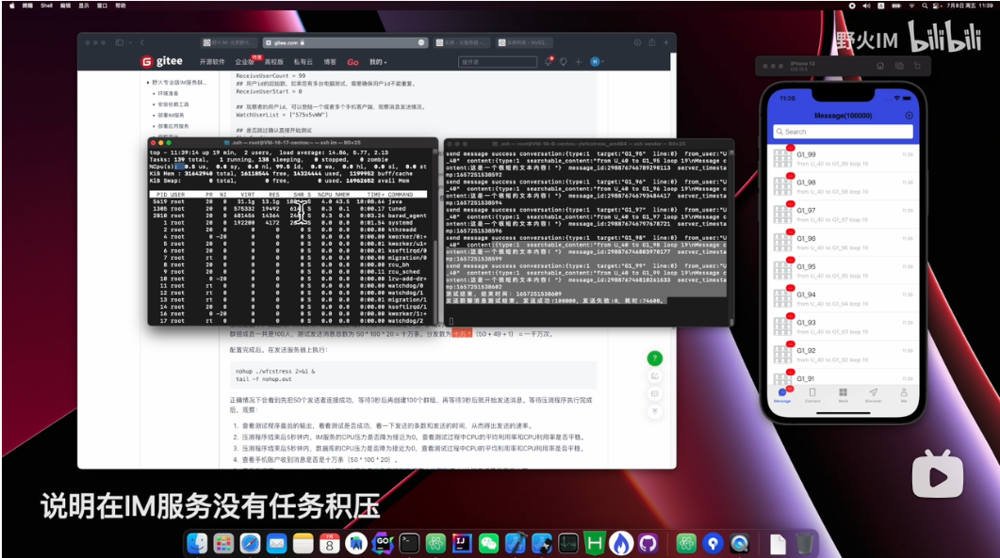

# 野火专业版IM服务群聊消息性能测试

## 环境准备
准备如下硬件资源：

| 用途 | 配置 | 数量 | 公网IP | 入访端口 | 出访端口 |
| ------ | ------ | ------ | ----- | ----- | ---- |
| IM服务 | 8C32G | 1 | 需要 |  80/1883/8888/18080 |  无 |
| 数据库 | 8C16G | 1 | 不需要 | 内网互通 |  内网互通 |
| 发送压测机 | 4C8G | 1 | 需要 | 无 |   80/1883/18080 |

建议直接购买云服务器和云MySQL进行压测，云服务都是经过优化的，可以直接压测使用。如果是自建服务，需要从网上找一下系统优化方法优化系统配置（至少openfiles改成10万以上）。避免使用个人PC来进行压测，因为个人PC环境有可能有限制性能的情况。

测试过程中要用到手机连接接收消息，所以需要用到外网，需要尽可能用最大的网络带宽。建议使用云服务器的按量计费方式，按流量计费可以选择把带宽设置为最大。

操作系统使用CentOS，其它Linux系统也行，不建议使用非Linux系统。

## 安装依赖工具
野火IM服务只依赖Java，CentOS使用下述命令安装，其它系统请自行查找方法。
```
yum install java-1.8.0-openjdk-headless.x86_64
```

## 部署IM服务
购买完云服务器后，就得到了云服务器的公网IP地址，联系野火来获取此公网IP的试用软件包。把软件包上传到IM服务器，解压，然后做出如下配置：
1. ```config/wildfirechat.conf```
```
server.ip ip地址为IM服务的公网IP
#使用mysql数据库
embed.db 0
## 各种限频的大小改为1000000
http.admin.rate_limit 1000000
client.request_rate_limit 1000000
## 消息队列大小改为10万，这样当手机离线后发送10万条以内消息，上线后可以都收到。
message.max_queue 100000
## 下面这个配置默认是关掉的，需要打开
netty.epoll true
```
2. ```config/c3p0.xml```
正确添加数据库JDBC、用户名和密码。

3. ```bin/wildfirechat.sh```
```
JAVA_OPTS="$JAVA_OPTS -Xmx24G"
JAVA_OPTS="$JAVA_OPTS -Xms24G"
```

修改完这些之后，进入bin目录执行 nohup ./wildfirechat.sh 2>&1 &，这样IM服务就部署完成了。

## 部署应用服务
在IM服务下载应用服务，地址在[http://static.wildfirechat.cn/app-server-release-0.58.tar.gz](http://static.wildfirechat.cn/app-server-release-0.58.tar.gz`)。下载后解压，修改config目录下的```im.propertie```：
```
im.welcome_for_new_user=
im.welcome_for_back_user=
im.new_user_robot_friend=false
im.robot_welcome=
```

其中```im.welcome_for_new_user```、```im.welcome_for_back_user``` 和 ```im.robot_welcome``` 配置为空，则手机登陆后不会发送欢迎语，避免测试干扰。

修改配置之后，使用命令 ``` java -jar app-0.58.jar ``` 来启动应用服务。等手机登陆成功后再停掉应用服务。

## 观察用户
需要手机登陆测试账户，在测试过程中观察手机消息状态。修改手机客户端中的应用服务和IM服务地址为IM服务器的公网IP地址，然后用SuperCode 66666 登陆。登陆成功后就可以关掉应用服务了。

可以在应用服务日志中找到用户ID或者在IM服务数据库中的```t_user_session```表中找到用户ID。

## 配置发送服务
在专业版IM服务软件包目录下有个```stress_test```目录，目录中有说明下载工具地址，下载测试工具到发送服务器，解压后得到一个可执行程序```wfcstress```和一个配置文件```config.toml```。

修改配置文件，只留下 ***IMConfig*** 和 ***TestGroupMessageConfig*** 配置项，其它都删除，然后配置如下:
```
# IM服务基础配置
[IMConfig]
## Host为专业版授权地址，如果其它地址测测试失败。
Host = "IM服务公网ip地址"
## 如果更改多客户端绑定端口，请把HttpPort改为定制的端口。
HttpPort = 80
AdminPort = 18080
AdminSecret = 123456
## Lite是否轻量模式，在lite为true时，压测工具只发送不会接收消息。如果测试聊天室功能请记得关闭此开关。
Lite = true
## 消息内容
## 较短文本消息内容，12个汉字，长度36B
MessageContent = "这是一个很短的文本内容！"


# 测试群聊消息。测试程序会创建SendUserCount个客户端并建立长链接。如果CreateGroup为true则会创建GroupCount群，群成员包括SendUserCount + ReceiveUserCount + WatchUserList.count 个成员。
# 一般首次测试时CreateGroup为true创建群组，第二次测试时可以改为false。如果要更改发送成员或者群成员，需要修改GroupPrefix重新建群。每个客户端循环给GroupCount个群发送消息。接收用户不会创建客户端。
[TestGroupMessageConfig]
## 是否开启此项测试
Enable = true
## 测试发送用户的前缀，用户ID为 ${SendUserPrefix}_i，SendUserPrefix U_ ，则用户ID为：U_0，U_1,U_2...。
## 用户的clientid为 用户id加上 c_, 比如c_U_0, c_U_1, c_U_2...。
SendUserPrefix = "U_"
## 发送消息用户数量，一般这个数字不要太大。
SendUserCount = 20
## 用户id的起始数，如果您有多台电脑测试，需要确保用户id不能重复。
SendUserStart = 0

## 是否创建群组。
CreateGroup = true
## 创建群组的群组id和名称的前缀，比如GroupPrefix为TEST_GROUP，则群组为：TEST_GROUP0, TEST_GROUP1, TEST_GROUP2...。
GroupPrefix = "G1_"
## 创建群组数量
GroupCount = 100
## 群组起始ID，如果您有多台电脑测试，需要确保群组id不能重复。
GroutStart = 0

## 客户端逐个给群组发送消息，此配置为发送消息的间隔，单位为毫秒。
SendMessageInterval = 0

## 群成员用户ID的前缀，注意不能跟发送者的前缀相同。
ReceiveUserPrefix = "RU_"
## 群成员的个数，实际上群组包含SendUserCount个发送用户，ReceiveUserCount个普通用户和WatchUserList.count个观察用户
ReceiveUserCount = 99
## 用户id的起始数，如果您有多台电脑测试，需要确保用户id不能重复。
ReceiveUserStart = 0

## 观察者的用户id，可以登陆一个或者多个手机客户端，观察消息发送情况。
WatchUserList = ["575v5vWW"]

## 是否跳过确认直接开始测试
SkipConfirm = true

## 循环次数。发送消息的总数为：SendUserCount * GroupCount * Loop；消息分发总数为 SendUserCount * GroupCount * (SendUserCount + ReceiveUserCount + WatchUserList.count) * Loop
Loop = 10
```
上述配置中，host要改为IM服务的公网IP地址，观察者用户id要填写手机账户的用户id，如果有多个，用逗号分开。```CreateGroup```配置为true，这样每次测试都会创建群组，这样就要求每次测试```GroupPrefix```都要改成一个不一样的名字。

## 测试百人群
修改发送服务配置如下：
```
SendUserCount = 50
CreateGroup = true
GroupPrefix = "G1_"
GroupCount = 100
ReceiveUserCount = 49
WatchUserList = ["575v5vWW"]
Loop = 20
```
上述配置中，发送用户为50人，测试创建群组，群组id的前缀是G1_，群组的个数是100个，群内其它用户和观察用户一共是50人，群组成员一共是100人，测试发送消息总数为 50 * 100 * 20 = 十万条。分发数为 十万 * （50 + 49 + 1） = 一千万次。

配置完成后。在发送服务器上执行：
```
nohup ./wfcstress 2>&1 &
tail -f nohup.out
```
正确情况下会看到先把50个发送者连接成功，等待3秒后再创建100个群组，再等待3秒后就开始发送消息。等待压测程序执行完成后，观察：
1. 查看测试程序最后的输出，看看测试是否成功，看一下发送的条数和发送的时间，从而得出发送的速率。
2. 压测程序结束后5秒钟内，IM服务的CPU压力是否降为接近为0，查看测试过程中CPU的平均利用率和CPU利用率是否平稳。
3. 压测程序结束后5秒钟内，数据库的CPU压力是否降为接近为0，查看测试过程中CPU的平均利用率和CPU利用率是否平稳。
4. 查看手机账户收到消息是否是十万条（50 * 100 * 20）。
5. 查看数据库t_messages_X(X的计算方法请参考[消息存储在数据库中的那张表中](https://docs.wildfirechat.cn/faq/server.html#Q_消息存储在数据库中的那张表中))的消息增量是否是十万。

## 测试两百人群
修改发送服务配置如下：
```
SendUserCount = 100
CreateGroup = true
GroupPrefix = "G2_"
GroupCount = 100
ReceiveUserCount = 99
WatchUserList = ["575v5vWW"]
Loop = 10
```
注意配置群组前缀要更换一个新的，测试之前重新创建群组。上述配置中，发送用户为100人，测试创建群组，群组id的前缀是G2_，群组的个数是100个，群内其它用户和观察用户一共是100人，群组成员一共是100人，测试发送消息总数为 100 * 100 * 10 = 十万条。分发数为 十万 * （100 + 99 + 1） = 二千万次。

配置完成后。在发送服务器上执行：
```
nohup ./wfcstress 2>&1 &
tail -f nohup.out
```
正确情况下会看到先把100个发送者连接成功，等待3秒后再创建100个群组，再等待3秒后就开始发送消息。等待压测程序执行完成后，观察：
1. 查看测试程序最后的输出，看看测试是否成功，看一下发送的条数和发送的时间，从而得出发送的速率。
2. 压测程序结束后5秒钟内，IM服务的CPU压力是否降为接近为0，查看测试过程中CPU的平均利用率和CPU利用率是否平稳。
3. 压测程序结束后5秒钟内，数据库的CPU压力是否降为接近为0，查看测试过程中CPU的平均利用率和CPU利用率是否平稳。
4. 查看手机账户收到消息是否是十万条（50 * 100 * 20）。
5. 查看数据库t_messages_X(X的计算方法请参考[消息存储在数据库中的那张表中](https://docs.wildfirechat.cn/faq/server.html#Q_消息存储在数据库中的那张表中))的消息增量是否是十万。

## 测试千人群
修改发送服务配置如下：
```
SendUserCount = 100
CreateGroup = true
GroupPrefix = "G3_"
GroupCount = 100
ReceiveUserCount = 899
WatchUserList = ["575v5vWW"]
Loop = 2
```
注意配置群组前缀要更换一个新的，测试之前重新创建群组。上述配置中，发送用户为100人，测试创建群组，群组id的前缀是G3_，群组的个数是100个，群内其它用户和观察用户一共是900人，群组成员一共是1000人，测试发送消息总数为 100 * 100 * 2 = 两万条。分发数为 两万 * （100 + 899 + 1） = 二千万次。

配置完成后。在发送服务器上执行：
```
nohup ./wfcstress 2>&1 &
tail -f nohup.out
```
正确情况下会看到先把100个发送者连接成功，等待3秒后再创建100个群组，再等待3秒后就开始发送消息。等待压测程序执行完成后，观察：
1. 查看测试程序最后的输出，看看测试是否成功，看一下发送的条数和发送的时间，从而得出发送的速率。
2. 压测程序结束后5秒钟内，IM服务的CPU压力是否降为接近为0，查看测试过程中CPU的平均利用率和CPU利用率是否平稳。
3. 压测程序结束后5秒钟内，数据库的CPU压力是否降为接近为0，查看测试过程中CPU的平均利用率和CPU利用率是否平稳。
4. 查看手机账户收到消息是否是两万条（100 * 100 * 2）。
5. 查看数据库t_messages_X(X的计算方法请参考[消息存储在数据库中的那张表中](https://docs.wildfirechat.cn/faq/server.html#Q_消息存储在数据库中的那张表中))的消息增量是否是二万。


## 测试结果
使用腾讯云北京6区一台标准S6云服务器8C32G和一台云MySQL服务8C16G，测试结果如下：
### 百人群发送消息测试：
测试方法：50个发送者，向100个群里发送消息，每个群有49个普通成员，1个观察用户，还有这50个发送者，一共是100群成员。发送20轮。

| 内容 | 结果 | 说明 |
| ------ | ------ | ------ |
| 服务资源 | 16核48G| 云服务器和云MySQL硬件资源合计计算  |
| 发送条数 | 10万 | 50 * 100 * 20 |
| 成功率 | 100% | 所有消息都成功落库，观察者接收消息条数正确 |
| CPU利用率 | 100% | CPU利用率打满说明服务无瓶颈 |
| 发送延迟 | 肉眼无法察觉 | 发送结束后，观察者立即收齐消息。服务器压力迅速降为0 |
| 发送时间 | 74.6秒 |  |
| 发送速率 | 1340条/秒 |  |
| 发送单核速率 | 83.75条/秒 | 发送测试速率除以核心数16 |
| 发送单核分发速率 | 8375条/秒 | 单核测试速度乘于100 |

### 两百人群发送消息测试：
测试方法：100个发送者，向100个群里发送消息，每个群有99个普通成员，1个观察用户，还有这100个发送者，一共是200群成员。发送10轮。

| 内容 | 结果 | 说明 |
| ------ | ------ | ------ |
| 服务资源 | 16核48G| 云服务器和云MySQL硬件资源合计计算  |
| 发送条数 | 10万 | 100 * 100 * 10 |
| 成功率 | 100% | 所有消息都成功落库，观察者接收消息条数正确 |
| CPU利用率 | 100% | CPU利用率打满说明服务无瓶颈 |
| 发送延迟 | 肉眼无法察觉 | 发送结束后，观察者立即收齐消息。服务器压力迅速降为0 |
| 发送时间 | 145.8秒 |  |
| 发送速率 | 685.8条/秒 |  |
| 发送单核速率 | 42.87条/秒 | 发送测试速率除以核心数16 |
| 发送单核分发速率 | 8573条/秒 | 单核测试速度乘于200 |

### 千人群发送消息测试：
测试方法：100个发送者，向100个群里发送消息，每个群有899个普通成员，1个观察用户，还有这100个发送者，一共是1000群成员。发送2轮。

| 内容 | 结果 | 说明 |
| ------ | ------ | ------ |
| 服务资源 | 16核48G| 云服务器和云MySQL硬件资源合计计算  |
| 发送条数 | 2万 | 100 * 100 * 2 |
| 成功率 | 100% | 所有消息都成功落库，观察者接收消息条数正确 |
| CPU利用率 | 100% | CPU利用率打满说明服务无瓶颈 |
| 发送延迟 | 肉眼无法察觉 | 发送结束后，观察者立即收齐消息。服务器压力迅速降为0 |
| 发送时间 | 142.8秒 |  |
| 发送速率 | 140条/秒 |  |
| 发送单核速率 | 8.75条/秒 | 发送测试速率除以核心数16 |
| 发送单核分发速率 | 8750条/秒 | 单核测试速度乘于1000 |

MySQL如果消息存储量太大，性能会有所降低。如果客户消息量非常大，可以使用mongodb来存储消息数据，mongodb的分片可以使数据增大也不会影响读写速度。


## 操作视频
为了帮助大家自行进行测试，我们录制了视频放到了B站，请点击下面视频观看:
<a href="https://www.bilibili.com/video/BV1dB4y1H7dn"></a>

## 总结
可以看到发送速率跟群的成员数基本成反比，但分发数基本维持在相同的一个水平上，符合预期。专业版IM服务的分发数达到单核每秒钟8000+，性能十分强悍。以上测试方法都是公开的，专业版用户可以自己来验证。
